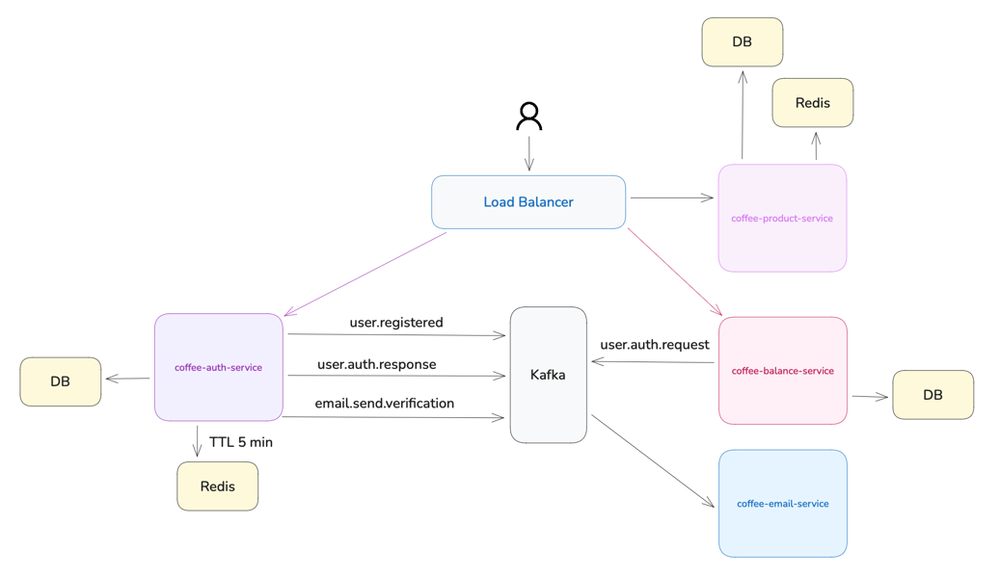
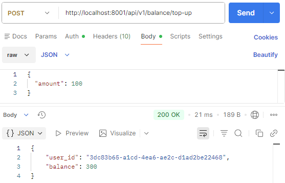
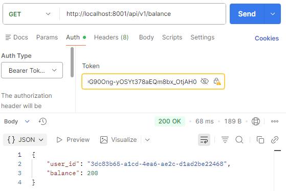
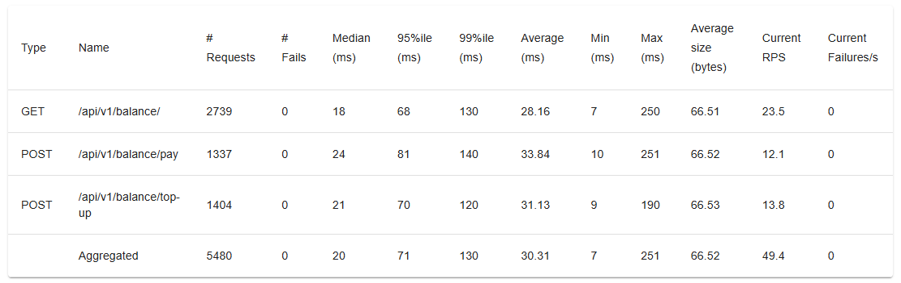
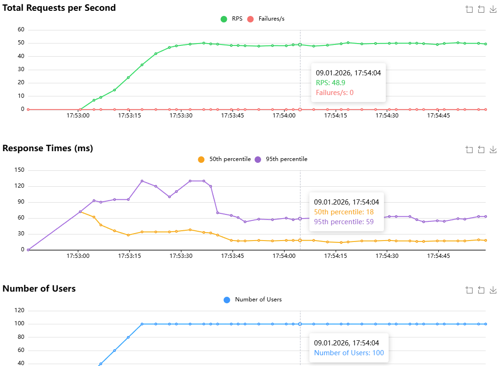

# coffee-balance-service


Сервис баланса пользователей. Отвечает за хранение и изменение баланса, взаимодействует с другими сервисами через события.

Упрощённая схема проекта.




## Архитектура проекта

### main.py

- Входная точка приложения.
- Настройка FastAPI, lifespan, Kafka, роутеров и health check.

### presentation

Отвечает за прием запросов от внешнего мира и передачу их в application layer.

- api/ — обработка HTTP-запросов, передает данные в application.services.
- consumers/ — обработка Kafka сообщений, передача в сервисы через handlers.

### application

Отвечает за бизнес-логику.

- services/ — бизнес-логика, использует интерфейсы (репозитории, события). 
Содержит логику бизнес-процессов, но не работает напрямую с базой данных или Kafka.
- interfaces/ — абстракции, которые реализует infrastructure.
- dtos/ — промежуточные структуры для передачи в presentation.


### domain

- entities/ — @dataclass для бизнес-сущностей, без ORM и фреймворков.
- errors.py — чистые ошибки домена, например BalanceNotFoundError.

### infrastructure

Знает как реализовать интерфейсы и работать с технологиями, но не содержит бизнес-логику.

- db/models/ — SQLAlchemy модели.
- repositories/ — реализация интерфейсов репозиториев.
- messaging/kafka/ — producer, consumer, router для Kafka.
- auth/ — AuthClient для Kafka авторизации.


## Запуск

Перед запуском убедитесь, что **minikube запущен**.

В `Deployment` используется `imagePullPolicy: IfNotPresent`.  
При необходимости можно:
- изменить на `Always`, либо
- загрузить образы в minikube вручную.

```
kubectl apply -f k8s/namespace.yaml
```
```
kubectl create secret generic coffee-balance-secrets \
  --from-env-file=.env \
  -n balance-dev
```
```
kubectl apply -f k8s/postgres -n balance-dev
```
```
kubectl apply -f k8s/api -n balance-dev
```

Убедитесь, что включён minikube tunnel:
```
minikube tunnel
```
Посмотреть поды:
```
kubectl get pods -n balance-dev
```
Смотреть логи (у вас контейнер с другим id):
```
kubectl logs -f coffee-balance-api-688d44b778-9w7c8 -n balance-dev
```

## API


### POST /api/v1/balance/top-up

Authorization: Bearer <JWT>

Вход:
```json
{
  "amount": 100
}
```
Выход:
```json
{
  "user_id": "uuid",
  "balance": 300
}
```



### GET /api/v1/balance

Authorization: Bearer <JWT>

Выход:
```json
{
  "user_id": "uuid",
  "balance": 300
}
```




## Нагрузочное тестирование с Locust




